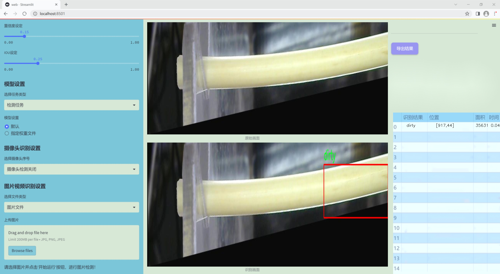
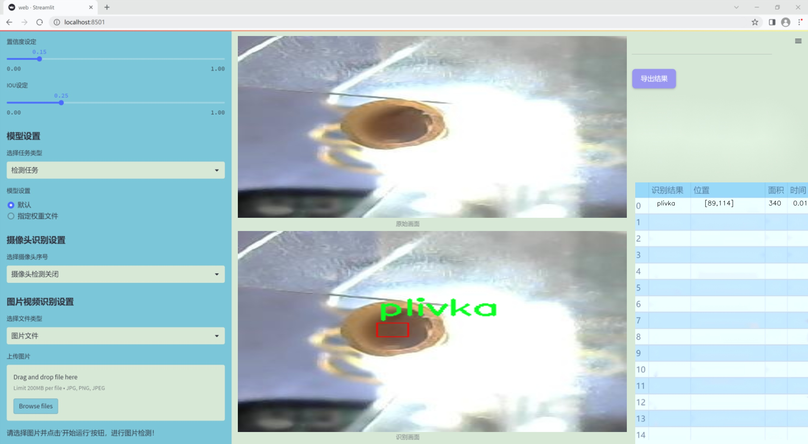
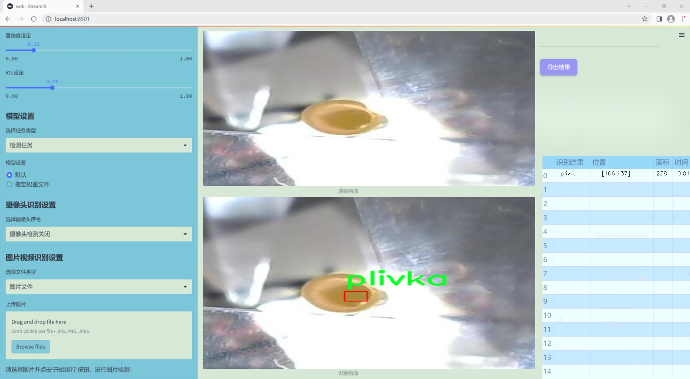
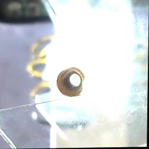
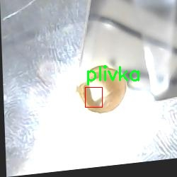
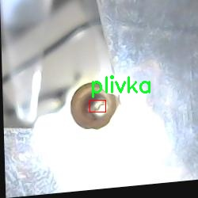

### 1.背景意义

研究背景与意义

在现代社会中，一次性筷子作为一种广泛使用的餐具，因其便捷性和卫生性而受到消费者的青睐。然而，随着生产规模的扩大，筷子的质量控制问题逐渐显现，尤其是表面缺陷的检测。表面缺陷不仅影响筷子的美观，更可能对消费者的健康造成潜在威胁。因此，开发一种高效、准确的表面缺陷检测系统显得尤为重要。

传统的缺陷检测方法多依赖人工检查，这不仅效率低下，而且容易受到人为因素的影响，导致漏检或误检的情况。随着计算机视觉技术的快速发展，基于深度学习的自动化检测方法逐渐成为研究热点。YOLO（You Only Look Once）系列模型因其高效的实时检测能力而被广泛应用于各类目标检测任务中。YOLOv11作为该系列的最新版本，具备更强的特征提取能力和更快的推理速度，为一次性筷子的表面缺陷检测提供了良好的技术基础。

本研究旨在基于改进的YOLOv11模型，构建一个针对一次性筷子表面缺陷的检测系统。所使用的数据集包含3153张经过精心标注的图像，涵盖了五种主要缺陷类型：断裂、切割、污垢、孔洞和表皮。这些缺陷的多样性为模型的训练提供了丰富的样本，有助于提高检测的准确性和鲁棒性。此外，通过对数据集进行多种预处理和增强技术的应用，进一步提升了模型的泛化能力。

通过本项目的实施，不仅可以提升一次性筷子的生产质量，还能为相关企业提供有效的质量控制解决方案，降低生产成本，提高市场竞争力。更重要的是，该系统的成功应用将为其他产品的缺陷检测提供借鉴，推动计算机视觉技术在工业领域的广泛应用。

### 2.视频效果

[2.1 视频效果](https://www.bilibili.com/video/BV1Qjm8Y8ETx/)

### 3.图片效果







##### [项目涉及的源码数据来源链接](https://kdocs.cn/l/cszuIiCKVNis)**

注意：本项目提供训练的数据集和训练教程,由于版本持续更新,暂不提供权重文件（best.pt）,请按照6.训练教程进行训练后实现上图演示的效果。

### 4.数据集信息

##### 4.1 本项目数据集类别数＆类别名

nc: 5
names: ['break', 'cut', 'dirty', 'hole', 'plivka']


该项目为【目标检测】数据集，请在【训练教程和Web端加载模型教程（第三步）】这一步的时候按照【目标检测】部分的教程来训练

##### 4.2 本项目数据集信息介绍

本项目数据集信息介绍

本项目旨在开发一个改进版的YOLOv11模型，以实现一次性筷子表面缺陷的高效检测。为此，我们构建了一个专门的数据集，聚焦于筷子表面可能出现的多种缺陷类型。该数据集包含五个主要类别，分别为“break”（断裂）、“cut”（切割）、“dirty”（脏污）、“hole”（孔洞）和“plivka”（薄膜）。这些类别的选择是基于对一次性筷子在生产和使用过程中常见缺陷的深入分析，确保能够覆盖大部分实际应用场景中的问题。

在数据集的构建过程中，我们收集了大量的图像数据，涵盖了不同光照、角度和背景条件下的筷子样本。每个类别的图像均经过精心标注，以确保模型在训练时能够准确识别各种缺陷。通过这种方式，我们不仅增强了数据集的多样性，还提高了模型的泛化能力，使其能够在真实环境中表现出色。

此外，为了提高检测系统的鲁棒性，我们还对数据集进行了数据增强处理，包括旋转、缩放、翻转等操作。这些技术手段旨在模拟实际使用中可能遇到的各种情况，从而使得训练出的模型能够在面对不同的挑战时，依然保持高效的检测能力。

通过对该数据集的深入分析和应用，我们期望能够显著提升一次性筷子表面缺陷检测的准确性和效率，为相关行业提供更为可靠的质量控制手段。随着该项目的推进，我们相信该数据集将为未来的研究和应用奠定坚实的基础。









### 5.全套项目环境部署视频教程（零基础手把手教学）

[5.1 所需软件PyCharm和Anaconda安装教程（第一步）](https://www.bilibili.com/video/BV1BoC1YCEKi/?spm_id_from=333.999.0.0&vd_source=bc9aec86d164b67a7004b996143742dc)


[5.2 安装Python虚拟环境创建和依赖库安装视频教程（第二步）](https://www.bilibili.com/video/BV1ZoC1YCEBw?spm_id_from=333.788.videopod.sections&vd_source=bc9aec86d164b67a7004b996143742dc)

### 6.改进YOLOv11训练教程和Web_UI前端加载模型教程（零基础手把手教学）

[6.1 改进YOLOv11训练教程和Web_UI前端加载模型教程（第三步）](https://www.bilibili.com/video/BV1BoC1YCEhR?spm_id_from=333.788.videopod.sections&vd_source=bc9aec86d164b67a7004b996143742dc)


按照上面的训练视频教程链接加载项目提供的数据集，运行train.py即可开始训练



     Epoch   gpu_mem       box       obj       cls    labels  img_size
     1/200     20.8G   0.01576   0.01955  0.007536        22      1280: 100%|██████████| 849/849 [14:42<00:00,  1.04s/it]
               Class     Images     Labels          P          R     mAP@.5 mAP@.5:.95: 100%|██████████| 213/213 [01:14<00:00,  2.87it/s]
                 all       3395      17314      0.994      0.957      0.0957      0.0843

     Epoch   gpu_mem       box       obj       cls    labels  img_size
     2/200     20.8G   0.01578   0.01923  0.007006        22      1280: 100%|██████████| 849/849 [14:44<00:00,  1.04s/it]
               Class     Images     Labels          P          R     mAP@.5 mAP@.5:.95: 100%|██████████| 213/213 [01:12<00:00,  2.95it/s]
                 all       3395      17314      0.996      0.956      0.0957      0.0845

     Epoch   gpu_mem       box       obj       cls    labels  img_size
     3/200     20.8G   0.01561    0.0191  0.006895        27      1280: 100%|██████████| 849/849 [10:56<00:00,  1.29it/s]
               Class     Images     Labels          P          R     mAP@.5 mAP@.5:.95: 100%|███████   | 187/213 [00:52<00:00,  4.04it/s]
                 all       3395      17314      0.996      0.957      0.0957      0.0845


###### [项目数据集下载链接](https://kdocs.cn/l/cszuIiCKVNis)

### 7.原始YOLOv11算法讲解


YOLO11 是 Ultralytics YOLO 系列的最新版本，结合了尖端的准确性、速度和效率，用于目标检测、分割、分类、定向边界框和姿态估计。与
YOLOv8 相比，它具有更少的参数和更好的结果，不难预见，YOLO11 在边缘设备上更高效、更快，将频繁出现在计算机视觉领域的最先进技术（SOTA）中。


**主要特点**

  * **增强的特征提取：**YOLO11 使用改进的主干和颈部架构来增强特征提取，以实现更精确的目标检测和复杂任务的性能。

  * **针对效率和速度优化：**精细的架构设计和优化的训练流程在保持准确性和性能之间最佳平衡的同时，提供更快的处理速度。

  * **更少的参数，更高的准确度：**YOLO11m 在 COCO 数据集上实现了比 YOLOv8m 更高的 mAP，参数减少了 22%，提高了计算效率，同时不牺牲准确度。

  * **跨环境的适应性：**YOLO11 可以无缝部署在边缘设备、云平台和配备 NVIDIA GPU 的系统上，确保最大的灵活性。

  * **支持广泛的任务范围：**YOLO11 支持各种计算机视觉任务，如目标检测、实例分割、图像分类、姿态估计和定向目标检测（OBB）。


### 8.200+种全套改进YOLOV11创新点原理讲解

#### 8.1 200+种全套改进YOLOV11创新点原理讲解大全

由于篇幅限制，每个创新点的具体原理讲解就不全部展开，具体见下列网址中的改进模块对应项目的技术原理博客网址【Blog】（创新点均为模块化搭建，原理适配YOLOv5~YOLOv11等各种版本）

[改进模块技术原理博客【Blog】网址链接](https://gitee.com/qunmasj/good)


#### 8.2 精选部分改进YOLOV11创新点原理讲解

###### 这里节选部分改进创新点展开原理讲解(完整的改进原理见上图和[改进模块技术原理博客链接](https://gitee.com/qunmasj/good)【如果此小节的图加载失败可以通过CSDN或者Github搜索该博客的标题访问原始博客，原始博客图片显示正常】

### Gold-YOLO


#### Preliminaries
YOLO系列的中间层结构采用了传统的FPN结构，其中包含多个分支用于多尺度特征融合。然而，它只充分融合来自相邻级别的特征，对于其他层次的信息只能间接地进行“递归”获取。

传统的FPN结构在信息传输过程中存在丢失大量信息的问题。这是因为层之间的信息交互仅限于中间层选择的信息，未被选择的信息在传输过程中被丢弃。这种情况导致某个Level的信息只能充分辅助相邻层，而对其他全局层的帮助较弱。因此，整体上信息融合的有效性可能受到限制。
为了避免在传输过程中丢失信息，本文采用了一种新颖的“聚集和分发”机制（GD），放弃了原始的递归方法。该机制使用一个统一的模块来收集和融合所有Level的信息，并将其分发到不同的Level。通过这种方式，作者不仅避免了传统FPN结构固有的信息丢失问题，还增强了中间层的部分信息融合能力，而且并没有显著增加延迟。


#### 低阶聚合和分发分支 Low-stage gather-and-distribute branch
从主干网络中选择输出的B2、B3、B4、B5特征进行融合，以获取保留小目标信息的高分辨率特征。


#### 高阶聚合和分发分支 High-stage gather-and-distribute branch
高级全局特征对齐模块（High-GD）将由低级全局特征对齐模块（Low-GD）生成的特征{P3, P4, P5}进行融合。


Transformer融合模块由多个堆叠的transformer组成，transformer块的数量为L。每个transformer块包括一个多头注意力块、一个前馈网络（FFN）和残差连接。采用与LeViT相同的设置来配置多头注意力块，使用16个通道作为键K和查询Q的头维度，32个通道作为值V的头维度。为了加速推理过程，将层归一化操作替换为批归一化，并将所有的GELU激活函数替换为ReLU。为了增强变换器块的局部连接，在两个1x1卷积层之间添加了一个深度卷积层。同时，将FFN的扩展因子设置为2，以在速度和计算成本之间取得平衡。


信息注入模块(Information injection module)： 高级全局特征对齐模块（High-GD）中的信息注入模块与低级全局特征对齐模块（Low-GD）中的相同。在高级阶段，局部特征（Flocal）等于Pi，因此公式如下所示：


#### 增强的跨层信息流动 Enhanced cross-layer information flow
为了进一步提升性能，从YOLOv6 中的PAFPN模块中得到启发，引入了Inject-LAF模块。该模块是注入模块的增强版，包括了一个轻量级相邻层融合（LAF）模块，该模块被添加到注入模块的输入位置。为了在速度和准确性之间取得平衡，设计了两个LAF模型：LAF低级模型和LAF高级模型，分别用于低级注入（合并相邻两层的特征）和高级注入（合并相邻一层的特征）。它们的结构如图5(b)所示。为了确保来自不同层级的特征图与目标大小对齐，在实现中的两个LAF模型仅使用了三个操作符：双线性插值（上采样过小的特征）、平均池化（下采样过大的特征）和1x1卷积（调整与目标通道不同的特征）。模型中的LAF模块与信息注入模块的结合有效地平衡了准确性和速度之间的关系。通过使用简化的操作，能够增加不同层级之间的信息流路径数量，从而提高性能而不显著增加延迟。


### 9.系统功能展示

图9.1.系统支持检测结果表格显示

  图9.2.系统支持置信度和IOU阈值手动调节

  图9.3.系统支持自定义加载权重文件best.pt(需要你通过步骤5中训练获得)

  图9.4.系统支持摄像头实时识别

  图9.5.系统支持图片识别

  图9.6.系统支持视频识别

  图9.7.系统支持识别结果文件自动保存

  图9.8.系统支持Excel导出检测结果数据


### 10. YOLOv11核心改进源码讲解

#### 10.1 dynamic_snake_conv.py

以下是经过精简和注释的核心代码，保留了DySnakeConv和DSConv类的主要功能，同时添加了详细的中文注释，以帮助理解代码的结构和功能。

```python
import torch
import torch.nn as nn
from ..modules.conv import Conv

__all__ = ['DySnakeConv']

class DySnakeConv(nn.Module):
    def __init__(self, inc, ouc, k=3) -> None:
        """
        动态蛇形卷积类
        :param inc: 输入通道数
        :param ouc: 输出通道数
        :param k: 卷积核大小
        """
        super().__init__()
        
        # 定义三个卷积层
        self.conv_0 = Conv(inc, ouc, k)  # 标准卷积
        self.conv_x = DSConv(inc, ouc, 0, k)  # 沿x轴的动态蛇形卷积
        self.conv_y = DSConv(inc, ouc, 1, k)  # 沿y轴的动态蛇形卷积
    
    def forward(self, x):
        """
        前向传播
        :param x: 输入特征图
        :return: 拼接后的输出特征图
        """
        # 将三个卷积的输出在通道维度上拼接
        return torch.cat([self.conv_0(x), self.conv_x(x), self.conv_y(x)], dim=1)

class DSConv(nn.Module):
    def __init__(self, in_ch, out_ch, morph, kernel_size=3, if_offset=True, extend_scope=1):
        """
        动态蛇形卷积
        :param in_ch: 输入通道数
        :param out_ch: 输出通道数
        :param morph: 卷积核的形态（沿x轴或y轴）
        :param kernel_size: 卷积核大小
        :param if_offset: 是否需要偏移
        :param extend_scope: 扩展范围
        """
        super(DSConv, self).__init__()
        # 用于学习可变形偏移的卷积层
        self.offset_conv = nn.Conv2d(in_ch, 2 * kernel_size, 3, padding=1)
        self.bn = nn.BatchNorm2d(2 * kernel_size)
        self.kernel_size = kernel_size

        # 定义沿x轴和y轴的动态蛇形卷积
        self.dsc_conv_x = nn.Conv2d(in_ch, out_ch, kernel_size=(kernel_size, 1), stride=(kernel_size, 1), padding=0)
        self.dsc_conv_y = nn.Conv2d(in_ch, out_ch, kernel_size=(1, kernel_size), stride=(1, kernel_size), padding=0)

        self.gn = nn.GroupNorm(out_ch // 4, out_ch)  # 组归一化
        self.act = Conv.default_act  # 默认激活函数

        self.extend_scope = extend_scope
        self.morph = morph
        self.if_offset = if_offset

    def forward(self, f):
        """
        前向传播
        :param f: 输入特征图
        :return: 卷积后的特征图
        """
        # 计算偏移
        offset = self.offset_conv(f)
        offset = self.bn(offset)
        offset = torch.tanh(offset)  # 将偏移限制在[-1, 1]之间

        # 创建动态蛇形卷积实例
        dsc = DSC(f.shape, self.kernel_size, self.extend_scope, self.morph)
        deformed_feature = dsc.deform_conv(f, offset, self.if_offset)  # 进行可变形卷积

        # 根据形态选择相应的卷积
        if self.morph == 0:
            x = self.dsc_conv_x(deformed_feature.type(f.dtype))
        else:
            x = self.dsc_conv_y(deformed_feature.type(f.dtype))

        x = self.gn(x)  # 进行组归一化
        x = self.act(x)  # 激活
        return x

# 动态蛇形卷积的核心计算类
class DSC(object):
    def __init__(self, input_shape, kernel_size, extend_scope, morph):
        """
        初始化DSC类
        :param input_shape: 输入特征图的形状
        :param kernel_size: 卷积核大小
        :param extend_scope: 扩展范围
        :param morph: 卷积核的形态
        """
        self.num_points = kernel_size
        self.width = input_shape[2]
        self.height = input_shape[3]
        self.morph = morph
        self.extend_scope = extend_scope  # 偏移范围

        # 定义特征图的形状
        self.num_batch = input_shape[0]
        self.num_channels = input_shape[1]

    def deform_conv(self, input, offset, if_offset):
        """
        进行可变形卷积
        :param input: 输入特征图
        :param offset: 偏移量
        :param if_offset: 是否使用偏移
        :return: 变形后的特征图
        """
        y, x = self._coordinate_map_3D(offset, if_offset)  # 计算坐标映射
        deformed_feature = self._bilinear_interpolate_3D(input, y, x)  # 双线性插值
        return deformed_feature

    # 计算坐标映射的具体实现
    def _coordinate_map_3D(self, offset, if_offset):
        # 此处省略具体实现
        pass

    # 双线性插值的具体实现
    def _bilinear_interpolate_3D(self, input_feature, y, x):
        # 此处省略具体实现
        pass
```

### 代码分析：
1. **DySnakeConv类**：这是一个包含三个卷积层的模块，其中一个是标准卷积，另外两个是动态蛇形卷积，分别沿x轴和y轴进行卷积操作。`forward`方法将三个卷积的输出在通道维度上拼接。

2. **DSConv类**：实现了动态蛇形卷积的具体逻辑。它包含了偏移卷积层和两个方向的卷积层。`forward`方法中，首先计算偏移，然后进行可变形卷积，并根据形态选择相应的卷积操作。

3. **DSC类**：这是动态蛇形卷积的核心计算类，负责计算坐标映射和进行双线性插值。`deform_conv`方法是其主要功能，调用了坐标映射和插值的方法。

### 注意：
- `_coordinate_map_3D`和`_bilinear_interpolate_3D`方法的具体实现被省略了，以简化代码示例。实际使用时需要实现这些方法以完成动态蛇形卷积的功能。

这个文件定义了一个动态蛇形卷积（Dynamic Snake Convolution）模块，主要用于图像处理和深度学习任务中。文件中包含了两个主要的类：`DySnakeConv` 和 `DSConv`，以及一个辅助类 `DSC`，用于实现动态蛇形卷积的具体操作。

`DySnakeConv` 类是整个模块的入口，继承自 `nn.Module`。在初始化方法中，它接收输入通道数 `inc`、输出通道数 `ouc` 和卷积核大小 `k` 作为参数。该类内部定义了三个卷积层：`conv_0` 是标准卷积，`conv_x` 和 `conv_y` 是动态蛇形卷积，分别沿着 x 轴和 y 轴进行操作。在前向传播方法 `forward` 中，它将输入 `x` 通过这三个卷积层处理后，将结果在通道维度上拼接起来并返回。

`DSConv` 类实现了动态蛇形卷积的具体逻辑。它同样继承自 `nn.Module`，在初始化时接收输入通道数、输出通道数、卷积核大小、形态参数、是否使用偏移以及扩展范围等参数。这个类的关键在于使用了一个偏移卷积层 `offset_conv`，用于学习可变形的偏移量，并通过批归一化 `bn` 进行处理。根据形态参数 `morph` 的不同，`DSConv` 定义了两种卷积方式：`dsc_conv_x` 和 `dsc_conv_y`，分别用于处理 x 轴和 y 轴的卷积。

在 `DSConv` 的前向传播方法中，首先通过 `offset_conv` 计算出偏移量，然后将其通过 `tanh` 函数限制在 -1 到 1 的范围内。接着，利用 `DSC` 类生成的坐标图进行变形卷积，最后根据形态参数选择合适的卷积层进行处理，并返回结果。

`DSC` 类是一个辅助类，负责处理坐标映射和双线性插值。它的构造函数接收输入形状、卷积核大小、扩展范围和形态参数。`_coordinate_map_3D` 方法用于生成变形卷积所需的坐标图，支持两种形态的卷积。`_bilinear_interpolate_3D` 方法则实现了对输入特征图的双线性插值，计算出变形后的特征图。

总体来说，这个文件实现了一个复杂的动态卷积操作，允许卷积核在输入特征图上进行灵活的变形，从而提高模型对图像特征的捕捉能力。这种方法在处理具有复杂形状或变化的图像时，能够提供更好的性能。

#### 10.2 dyhead_prune.py

以下是代码中最核心的部分，并附上详细的中文注释：

```python
import torch
import torch.nn as nn
import torch.nn.functional as F

class DyReLU(nn.Module):
    """
    动态ReLU激活函数模块，能够根据输入动态调整激活函数的参数。
    """
    def __init__(self, inp, reduction=4, lambda_a=1.0, K2=True, use_bias=True, use_spatial=False,
                 init_a=[1.0, 0.0], init_b=[0.0, 0.0]):
        super(DyReLU, self).__init__()
        self.oup = inp  # 输出通道数
        self.lambda_a = lambda_a * 2  # 调整参数
        self.K2 = K2  # 是否使用K2
        self.avg_pool = nn.AdaptiveAvgPool2d(1)  # 自适应平均池化层

        self.use_bias = use_bias  # 是否使用偏置
        # 根据是否使用偏置和K2来决定exp的值
        self.exp = 4 if use_bias else 2 if K2 else 2 if use_bias else 1
        self.init_a = init_a  # 初始化参数a
        self.init_b = init_b  # 初始化参数b

        # 确定压缩比例
        squeeze = inp // reduction if reduction == 4 else _make_divisible(inp // reduction, 4)

        # 定义全连接层
        self.fc = nn.Sequential(
            nn.Linear(inp, squeeze),  # 输入到压缩层
            nn.ReLU(inplace=True),  # ReLU激活
            nn.Linear(squeeze, self.oup * self.exp),  # 压缩层到输出层
            h_sigmoid()  # 使用h_sigmoid激活
        )
        # 如果使用空间注意力，则定义空间卷积层
        self.spa = nn.Sequential(
            nn.Conv2d(inp, 1, kernel_size=1),
            nn.BatchNorm2d(1),
        ) if use_spatial else None

    def forward(self, x):
        """
        前向传播函数
        :param x: 输入张量，可以是列表或单个张量
        :return: 输出张量
        """
        # 处理输入
        x_in = x[0] if isinstance(x, list) else x
        x_out = x[1] if isinstance(x, list) else x
        b, c, h, w = x_in.size()  # 获取输入的形状

        # 通过自适应平均池化获取特征
        y = self.avg_pool(x_in).view(b, c)
        y = self.fc(y).view(b, self.oup * self.exp, 1, 1)  # 通过全连接层

        # 根据exp的值进行不同的处理
        if self.exp == 4:
            a1, b1, a2, b2 = torch.split(y, self.oup, dim=1)  # 分割输出
            a1 = (a1 - 0.5) * self.lambda_a + self.init_a[0]  # 调整参数
            a2 = (a2 - 0.5) * self.lambda_a + self.init_a[1]
            b1 = b1 - 0.5 + self.init_b[0]
            b2 = b2 - 0.5 + self.init_b[1]
            out = torch.max(x_out * a1 + b1, x_out * a2 + b2)  # 计算输出
        elif self.exp == 2:
            if self.use_bias:
                a1, b1 = torch.split(y, self.oup, dim=1)
                a1 = (a1 - 0.5) * self.lambda_a + self.init_a[0]
                b1 = b1 - 0.5 + self.init_b[0]
                out = x_out * a1 + b1
            else:
                a1, a2 = torch.split(y, self.oup, dim=1)
                a1 = (a1 - 0.5) * self.lambda_a + self.init_a[0]
                a2 = (a2 - 0.5) * self.lambda_a + self.init_a[1]
                out = torch.max(x_out * a1, x_out * a2)
        elif self.exp == 1:
            a1 = y
            a1 = (a1 - 0.5) * self.lambda_a + self.init_a[0]
            out = x_out * a1

        # 如果使用空间注意力，则进行空间加权
        if self.spa:
            ys = self.spa(x_in).view(b, -1)
            ys = F.softmax(ys, dim=1).view(b, 1, h, w) * h * w
            ys = F.hardtanh(ys, 0, 3, inplace=True) / 3
            out = out * ys

        return out

class DyDCNv2(nn.Module):
    """
    使用归一化层的ModulatedDeformConv2d模块，用于DyHead。
    """
    def __init__(self, in_channels, out_channels, stride=1, norm_cfg=dict(type='GN', num_groups=16, requires_grad=True)):
        super().__init__()
        self.with_norm = norm_cfg is not None  # 是否使用归一化
        bias = not self.with_norm  # 如果不使用归一化，则使用偏置
        self.conv = ModulatedDeformConv2d(in_channels, out_channels, 3, stride=stride, padding=1, bias=bias)  # 定义可调变形卷积
        if self.with_norm:
            self.norm = build_norm_layer(norm_cfg, out_channels)[1]  # 定义归一化层

    def forward(self, x, offset, mask):
        """
        前向传播函数
        :param x: 输入张量
        :param offset: 偏移量
        :param mask: 掩码
        :return: 输出张量
        """
        x = self.conv(x.contiguous(), offset, mask)  # 通过卷积层
        if self.with_norm:
            x = self.norm(x)  # 通过归一化层
        return x

class DyHeadBlock_Prune(nn.Module):
    """
    DyHead块，包含三种类型的注意力机制。
    """
    def __init__(self, in_channels, norm_type='GN', zero_init_offset=True, act_cfg=dict(type='HSigmoid', bias=3.0, divisor=6.0)):
        super().__init__()
        self.zero_init_offset = zero_init_offset  # 是否初始化偏移为零
        self.offset_and_mask_dim = 3 * 3 * 3  # 偏移和掩码的维度
        self.offset_dim = 2 * 3 * 3  # 偏移的维度

        # 根据归一化类型选择归一化配置
        norm_dict = dict(type='GN', num_groups=16, requires_grad=True) if norm_type == 'GN' else dict(type='BN', requires_grad=True)

        # 定义不同层的卷积
        self.spatial_conv_high = DyDCNv2(in_channels, in_channels, norm_cfg=norm_dict)
        self.spatial_conv_mid = DyDCNv2(in_channels, in_channels)
        self.spatial_conv_low = DyDCNv2(in_channels, in_channels, stride=2)
        self.spatial_conv_offset = nn.Conv2d(in_channels, self.offset_and_mask_dim, 3, padding=1)  # 偏移卷积层
        self.scale_attn_module = nn.Sequential(
            nn.AdaptiveAvgPool2d(1), nn.Conv2d(in_channels, 1, 1),
            nn.ReLU(inplace=True), build_activation_layer(act_cfg))  # 缩放注意力模块
        self.task_attn_module = DyReLU(in_channels)  # 任务注意力模块
        self._init_weights()  # 初始化权重

    def _init_weights(self):
        """
        权重初始化函数
        """
        for m in self.modules():
            if isinstance(m, nn.Conv2d):
                normal_init(m, 0, 0.01)  # 正态初始化卷积层
        if self.zero_init_offset:
            constant_init(self.spatial_conv_offset, 0)  # 偏移卷积层初始化为零

    def forward(self, x, level):
        """
        前向传播函数
        :param x: 输入特征图
        :param level: 特征图的层级
        :return: 输出特征图
        """
        # 计算DCNv2的偏移和掩码
        offset_and_mask = self.spatial_conv_offset(x[level])
        offset = offset_and_mask[:, :self.offset_dim, :, :]  # 获取偏移
        mask = offset_and_mask[:, self.offset_dim:, :, :].sigmoid()  # 获取掩码并应用sigmoid

        mid_feat = self.spatial_conv_mid(x[level], offset, mask)  # 中层特征
        sum_feat = mid_feat * self.scale_attn_module(mid_feat)  # 加权中层特征
        summed_levels = 1  # 计数已加权的层数

        # 如果有低层特征，则加权
        if level > 0:
            low_feat = self.spatial_conv_low(x[level - 1], offset, mask)
            sum_feat += low_feat * self.scale_attn_module(low_feat)
            summed_levels += 1

        # 如果有高层特征，则加权
        if level < len(x) - 1:
            high_feat = F.interpolate(
                self.spatial_conv_high(x[level + 1], offset, mask),
                size=x[level].shape[-2:],
                mode='bilinear',
                align_corners=True)
            sum_feat += high_feat * self.scale_attn_module(high_feat)
            summed_levels += 1

        return self.task_attn_module(sum_feat / summed_levels)  # 返回任务注意力模块的输出
```

以上代码实现了动态ReLU激活函数、可调变形卷积和DyHead块，适用于深度学习中的动态特征提取和注意力机制。每个模块的功能和前向传播过程都进行了详细注释。

这个程序文件 `dyhead_prune.py` 实现了一些深度学习中的模块，主要用于动态头（Dynamic Head）结构的构建，特别是在目标检测等任务中。文件中使用了 PyTorch 框架，并定义了多个类和函数，下面对其进行逐步说明。

首先，文件导入了必要的库，包括 PyTorch 的核心库和一些用于构建卷积层、激活函数和归一化层的工具。如果导入失败，程序会捕获异常但不做处理。

接下来，定义了一个 `_make_divisible` 函数，该函数用于确保输入的数值可以被指定的除数整除，通常用于调整网络层的通道数，以满足特定的硬件要求。

然后，定义了几个激活函数的类，包括 `swish`、`h_swish` 和 `h_sigmoid`。这些类继承自 `nn.Module`，并实现了 `forward` 方法，分别对应不同的激活函数。`h_swish` 和 `h_sigmoid` 还支持 `inplace` 操作，以节省内存。

`DyReLU` 类是一个动态激活函数模块，它根据输入特征动态调整激活函数的参数。该模块使用了自适应平均池化和全连接层来计算激活函数的参数，并支持空间注意力机制。它的 `forward` 方法根据输入的特征计算输出，考虑了不同的参数初始化和可选的空间注意力。

`DyDCNv2` 类实现了带有归一化层的可调变形卷积。它使用 `ModulatedDeformConv2d` 进行卷积操作，并根据配置选择是否使用归一化层。该类的 `forward` 方法接收输入特征、偏移量和掩码，并进行卷积和归一化处理。

最后，`DyHeadBlock_Prune` 类是整个模块的核心，结合了多个注意力机制。它初始化了多个卷积层和注意力模块，并在 `forward` 方法中计算不同层次特征的偏移量和掩码。通过结合中层、低层和高层特征，该模块能够生成更丰富的特征表示，适用于多层次的特征融合。

总的来说，这个文件实现了一个复杂的动态头结构，结合了多种激活函数、卷积操作和注意力机制，旨在提高深度学习模型在特定任务中的表现。

#### 10.3 kan_conv.py

以下是保留的核心代码部分，并添加了详细的中文注释：

```python
import torch
import torch.nn as nn

class KANConvNDLayer(nn.Module):
    def __init__(self, conv_class, norm_class, input_dim, output_dim, spline_order, kernel_size,
                 groups=1, padding=0, stride=1, dilation=1,
                 ndim: int = 2, grid_size=5, base_activation=nn.GELU, grid_range=[-1, 1], dropout=0.0):
        super(KANConvNDLayer, self).__init__()
        
        # 初始化参数
        self.inputdim = input_dim  # 输入维度
        self.outdim = output_dim    # 输出维度
        self.spline_order = spline_order  # 样条阶数
        self.kernel_size = kernel_size  # 卷积核大小
        self.padding = padding  # 填充
        self.stride = stride  # 步幅
        self.dilation = dilation  # 膨胀
        self.groups = groups  # 分组卷积的组数
        self.ndim = ndim  # 数据的维度（1D, 2D, 3D）
        self.grid_size = grid_size  # 网格大小
        self.base_activation = base_activation()  # 基础激活函数
        self.grid_range = grid_range  # 网格范围

        # 初始化 dropout
        self.dropout = None
        if dropout > 0:
            if ndim == 1:
                self.dropout = nn.Dropout1d(p=dropout)
            elif ndim == 2:
                self.dropout = nn.Dropout2d(p=dropout)
            elif ndim == 3:
                self.dropout = nn.Dropout3d(p=dropout)

        # 检查分组参数的有效性
        if groups <= 0:
            raise ValueError('groups must be a positive integer')
        if input_dim % groups != 0:
            raise ValueError('input_dim must be divisible by groups')
        if output_dim % groups != 0:
            raise ValueError('output_dim must be divisible by groups')

        # 创建基础卷积层和样条卷积层
        self.base_conv = nn.ModuleList([conv_class(input_dim // groups,
                                                   output_dim // groups,
                                                   kernel_size,
                                                   stride,
                                                   padding,
                                                   dilation,
                                                   groups=1,
                                                   bias=False) for _ in range(groups)])

        self.spline_conv = nn.ModuleList([conv_class((grid_size + spline_order) * input_dim // groups,
                                                     output_dim // groups,
                                                     kernel_size,
                                                     stride,
                                                     padding,
                                                     dilation,
                                                     groups=1,
                                                     bias=False) for _ in range(groups)])

        # 创建归一化层和激活层
        self.layer_norm = nn.ModuleList([norm_class(output_dim // groups) for _ in range(groups)])
        self.prelus = nn.ModuleList([nn.PReLU() for _ in range(groups)])

        # 初始化网格
        h = (self.grid_range[1] - self.grid_range[0]) / grid_size
        self.grid = torch.linspace(
            self.grid_range[0] - h * spline_order,
            self.grid_range[1] + h * spline_order,
            grid_size + 2 * spline_order + 1,
            dtype=torch.float32
        )

        # 使用 Kaiming 均匀分布初始化卷积层的权重
        for conv_layer in self.base_conv:
            nn.init.kaiming_uniform_(conv_layer.weight, nonlinearity='linear')

        for conv_layer in self.spline_conv:
            nn.init.kaiming_uniform_(conv_layer.weight, nonlinearity='linear')

    def forward_kan(self, x, group_index):
        # 对输入应用基础激活函数并进行线性变换
        base_output = self.base_conv[group_index](self.base_activation(x))

        x_uns = x.unsqueeze(-1)  # 扩展维度以进行样条操作
        target = x.shape[1:] + self.grid.shape  # 计算目标形状
        grid = self.grid.view(*list([1 for _ in range(self.ndim + 1)] + [-1, ])).expand(target).contiguous().to(x.device)

        # 计算样条基
        bases = ((x_uns >= grid[..., :-1]) & (x_uns < grid[..., 1:])).to(x.dtype)

        # 计算多个阶数的样条基
        for k in range(1, self.spline_order + 1):
            left_intervals = grid[..., :-(k + 1)]
            right_intervals = grid[..., k:-1]
            delta = torch.where(right_intervals == left_intervals, torch.ones_like(right_intervals),
                                right_intervals - left_intervals)
            bases = ((x_uns - left_intervals) / delta * bases[..., :-1]) + \
                    ((grid[..., k + 1:] - x_uns) / (grid[..., k + 1:] - grid[..., 1:(-k)]) * bases[..., 1:])
        bases = bases.contiguous()
        bases = bases.moveaxis(-1, 2).flatten(1, 2)  # 重新排列和展平基

        # 通过样条卷积层进行卷积操作
        spline_output = self.spline_conv[group_index](bases)
        x = self.prelus[group_index](self.layer_norm[group_index](base_output + spline_output))

        # 应用 dropout
        if self.dropout is not None:
            x = self.dropout(x)

        return x

    def forward(self, x):
        # 将输入分割为多个组进行处理
        split_x = torch.split(x, self.inputdim // self.groups, dim=1)
        output = []
        for group_ind, _x in enumerate(split_x):
            y = self.forward_kan(_x.clone(), group_ind)  # 对每个组调用 forward_kan
            output.append(y.clone())
        y = torch.cat(output, dim=1)  # 合并输出
        return y
```

### 代码说明
1. **类 KANConvNDLayer**: 这是一个自定义的多维卷积层，支持1D、2D和3D卷积。它结合了基础卷积和样条卷积的特性。
2. **初始化方法**: 在初始化中，设置了输入输出维度、卷积参数、激活函数、dropout等，并创建了相应的卷积层和归一化层。
3. **forward_kan 方法**: 该方法实现了前向传播，计算基础卷积和样条卷积的输出，并进行激活和归一化处理。
4. **forward 方法**: 该方法将输入分割为多个组，分别处理每个组的输入，然后将结果合并为最终输出。

这个程序文件定义了一个名为 `KANConvNDLayer` 的神经网络层，主要用于实现一种新的卷积操作，支持多维输入（如1D、2D、3D）。该层的设计结合了基础卷积、样条卷积和归一化操作，以提高模型的表达能力和训练效果。

在 `KANConvNDLayer` 的构造函数中，初始化了一系列参数，包括输入和输出维度、卷积核大小、样条的阶数、分组数、填充、步幅、扩张率等。通过这些参数，可以灵活地配置卷积层的行为。此外，还可以选择不同的激活函数和丢弃率（dropout）来增强模型的泛化能力。

该类使用 `nn.ModuleList` 来存储多个卷积层、归一化层和激活层，支持分组卷积的实现。每个组的卷积层和归一化层都是独立的，这样可以在同一层中处理不同的特征子集。构造函数中还对卷积层的权重进行了 Kaiming 均匀初始化，以便在训练开始时提供更好的权重分布。

`forward_kan` 方法是该类的核心计算部分，首先对输入进行基础激活，然后进行基础卷积的线性变换。接着，通过样条基函数计算样条卷积的输出。样条基函数的计算涉及到输入值与预定义网格之间的关系，使用了一系列的张量操作来实现。最后，将基础卷积和样条卷积的输出相加，并通过归一化和激活函数处理后返回结果。

`forward` 方法负责处理输入数据，将其分割成多个组，然后依次调用 `forward_kan` 方法进行计算，最后将所有组的输出拼接在一起，形成最终的输出。

此外，文件中还定义了三个子类 `KANConv1DLayer`、`KANConv2DLayer` 和 `KANConv3DLayer`，分别对应于一维、二维和三维卷积层。这些子类通过调用父类的构造函数，传入相应的卷积和归一化类，简化了不同维度卷积层的创建过程。

整体而言，这个程序文件实现了一个灵活且功能强大的卷积层，能够适应多种维度的输入，并结合了样条卷积的优势，适用于复杂的深度学习任务。

#### 10.4 rep_block.py

以下是保留的核心代码部分，并附上详细的中文注释：

```python
import torch
import torch.nn as nn
import torch.nn.functional as F

# 定义一个函数用于将卷积层和批归一化层的权重和偏置融合
def transI_fusebn(kernel, bn):
    gamma = bn.weight  # 获取批归一化的缩放因子
    std = (bn.running_var + bn.eps).sqrt()  # 计算标准差
    # 返回融合后的卷积核和偏置
    return kernel * ((gamma / std).reshape(-1, 1, 1, 1)), bn.bias - bn.running_mean * gamma / std

# 定义一个卷积和批归一化的组合层
def conv_bn(in_channels, out_channels, kernel_size, stride=1, padding=0, dilation=1, groups=1):
    # 创建卷积层
    conv_layer = nn.Conv2d(in_channels=in_channels, out_channels=out_channels, kernel_size=kernel_size,
                           stride=stride, padding=padding, dilation=dilation, groups=groups,
                           bias=False)
    # 创建批归一化层
    bn_layer = nn.BatchNorm2d(num_features=out_channels, affine=True)
    # 将卷积层和批归一化层组合成一个序列
    return nn.Sequential(conv_layer, bn_layer)

# 定义一个多分支块的类
class DiverseBranchBlock(nn.Module):
    def __init__(self, in_channels, out_channels, kernel_size, stride=1, padding=None, dilation=1, groups=1):
        super(DiverseBranchBlock, self).__init__()
        
        # 如果没有指定填充，则自动计算
        if padding is None:
            padding = kernel_size // 2  # 默认填充为卷积核大小的一半
        
        # 定义原始卷积和批归一化层
        self.dbb_origin = conv_bn(in_channels=in_channels, out_channels=out_channels, kernel_size=kernel_size,
                                  stride=stride, padding=padding, dilation=dilation, groups=groups)

        # 定义一个平均池化分支
        self.dbb_avg = nn.Sequential(
            nn.Conv2d(in_channels=in_channels, out_channels=out_channels, kernel_size=1, stride=1, padding=0, groups=groups, bias=False),
            nn.BatchNorm2d(out_channels),
            nn.AvgPool2d(kernel_size=kernel_size, stride=stride, padding=0)
        )

        # 定义一个1x1卷积分支
        self.dbb_1x1_kxk = nn.Sequential(
            nn.Conv2d(in_channels=in_channels, out_channels=out_channels, kernel_size=kernel_size, stride=stride, padding=0, groups=groups, bias=False),
            nn.BatchNorm2d(out_channels)
        )

    def forward(self, inputs):
        # 计算各个分支的输出
        out = self.dbb_origin(inputs)  # 原始卷积分支
        out += self.dbb_avg(inputs)     # 平均池化分支
        out += self.dbb_1x1_kxk(inputs) # 1x1卷积分支
        return out  # 返回最终输出

# 示例使用
if __name__ == "__main__":
    # 创建一个DiverseBranchBlock实例
    model = DiverseBranchBlock(in_channels=3, out_channels=16, kernel_size=3)
    # 随机生成一个输入张量
    input_tensor = torch.randn(1, 3, 64, 64)  # batch_size=1, channels=3, height=64, width=64
    # 前向传播
    output = model(input_tensor)
    print(output.shape)  # 输出形状
```

### 代码注释说明：
1. **transI_fusebn**：此函数用于将卷积层的权重与批归一化层的参数融合，返回融合后的卷积核和偏置。
2. **conv_bn**：此函数创建一个包含卷积层和批归一化层的组合层，便于后续使用。
3. **DiverseBranchBlock**：这是一个多分支块的实现，包含原始卷积、平均池化和1x1卷积分支。它的`forward`方法计算各个分支的输出并相加，返回最终结果。
4. **示例使用**：在主程序中创建一个`DiverseBranchBlock`实例，并进行前向传播以测试模型的输出形状。

这个程序文件 `rep_block.py` 定义了一些用于构建深度学习模型的模块，主要是多分支卷积块（Diverse Branch Block）。这些模块可以用于图像处理任务，尤其是在卷积神经网络（CNN）中。文件中包含了多个类和函数，下面对其进行逐一说明。

首先，文件导入了必要的库，包括 PyTorch 的核心库和一些自定义的卷积模块。接着，定义了一些用于卷积和批归一化（Batch Normalization）融合的函数。这些函数主要用于处理卷积核和偏置的变换，以便在不同的网络结构中实现更高效的计算。

`transI_fusebn` 函数用于将卷积层的权重与批归一化层的参数融合，返回融合后的卷积核和偏置。`transII_addbranch` 函数则用于将多个卷积核和偏置相加，适用于多分支结构。其他的变换函数如 `transIII_1x1_kxk`、`transIV_depthconcat`、`transV_avg` 和 `transVI_multiscale` 分别处理不同类型的卷积操作和维度调整。

接下来，定义了几个主要的类：

1. **IdentityBasedConv1x1**：这是一个1x1卷积层，支持分组卷积。它通过在卷积核中添加一个单位矩阵来实现身份映射。这个类的 `forward` 方法执行卷积操作，并返回结果。

2. **BNAndPadLayer**：这个类结合了批归一化和填充操作。它在前向传播时首先进行批归一化，然后根据需要对输出进行填充。

3. **DiverseBranchBlock**：这是一个多分支卷积块的核心实现。它根据输入的通道数、输出通道数、卷积核大小等参数初始化多个卷积分支，包括原始卷积、1x1卷积、平均池化等。`forward` 方法在前向传播时将所有分支的输出相加，并通过非线性激活函数进行处理。

4. **DiverseBranchBlockNOAct**：这是一个不包含激活函数的多分支卷积块，功能与 `DiverseBranchBlock` 类似，但不应用非线性激活。

5. **DeepDiverseBranchBlock**：这个类扩展了 `DiverseBranchBlock`，在其基础上增加了更多的卷积层和功能，适用于更深的网络结构。

6. **WideDiverseBranchBlock**：这是一个宽多分支卷积块，除了常规的卷积分支外，还增加了水平和垂直卷积操作，以增强特征提取能力。

每个类都有其特定的初始化方法和前向传播逻辑，能够根据不同的需求构建复杂的卷积网络结构。整体来看，这个文件提供了一种灵活的方式来构建多分支卷积网络，适用于各种图像处理任务。

### 11.完整训练+Web前端界面+200+种全套创新点源码、数据集获取


# [下载链接：https://mbd.pub/o/bread/Z5Wbk51x](https://mbd.pub/o/bread/Z5Wbk51x)